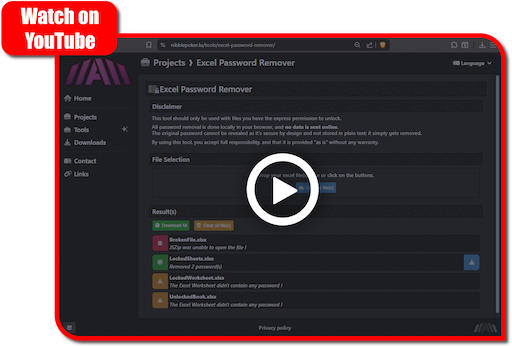

# Excel Worksheet Password Remover
Small web application from which you can easily remove a password from an Excel worksheet. \
It works by leaving the task of editing the XML files on an Excel document to your browser instead to keep everything local.

This repository simply is a rendered versions of the various templates and JS modules in 
[Web-NibblePoker](https://github.com/aziascreations/Web-NibblePoker). \
As such, the code in this repository is pre-minified and harder to read.

The old readable version of this tool can be still found in the [legacy-v1.0.0](https://github.com/aziascreations/Excel-Worksheet-Password-Remover/tree/legacy-v1.0.0) branch.

## Disclaimer
This tool should only be used with files you have the express permission to unlock.

All password removal is done locally in your browser, and no data is sent online. \
The original password cannot be revealed as it’s secure by design and not stored in plain text; it simply gets removed.

By using this tool, you accept full responsibility, and that it is provided “as is” without any warranty.

## Using the tool
To use this tool you can either visit *"[nibblepoker.lu/tools/excel-password-remover](https://nibblepoker.lu/tools/excel-password-remover/)"*, download the repository, or the [latest release](https://github.com/aziascreations/Excel-Worksheet-Password-Remover/releases).

## Video Demo

## License
This tool uses the [JSZip](https://stuk.github.io/jszip/) library, which is licensed under the
[MIT license](https://github.com/Stuk/jszip/blob/main/LICENSE.markdown).
The rest of this tool's code is released in the [public domain](https://github.com/aziascreations/Web-NibblePoker).
